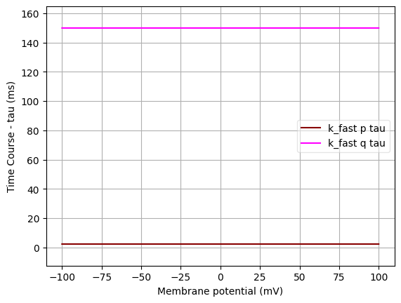
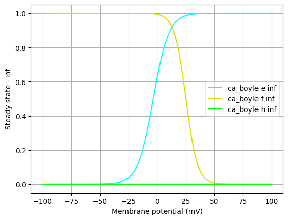

Channel information
===================

Channel information at: T = 34.0 degC, E_rev = 50.0 mV, [Ca2+] = 0.001 mM

<h2>k_fast</h2>

Ion: <b>k</b> |
Conductance expression: <b>g = gmax * p4 * q </b> |
NeuroML2 file: <a href="../k_fast.channel.nml">k_fast.channel.nml</a>

Notes
K fast channel from Boyle and Cohen 2008

<h2>k_slow</h2>

Ion: <b>k</b> |
Conductance expression: <b>g = gmax * n </b> |
NeuroML2 file: <a href="../k_slow.channel.nml">k_slow.channel.nml</a>

Notes
K slow channel from Boyle and Cohen 2008

<h2>ca_boyle</h2>

Ion: <b>ca</b> |
Conductance expression: <b>g = gmax * e2 * f * h </b> |
NeuroML2 file: <a href="../ca_boyle.channel.nml">ca_boyle.channel.nml</a>

Notes
Ca channel from Boyle and Cohen 2008

