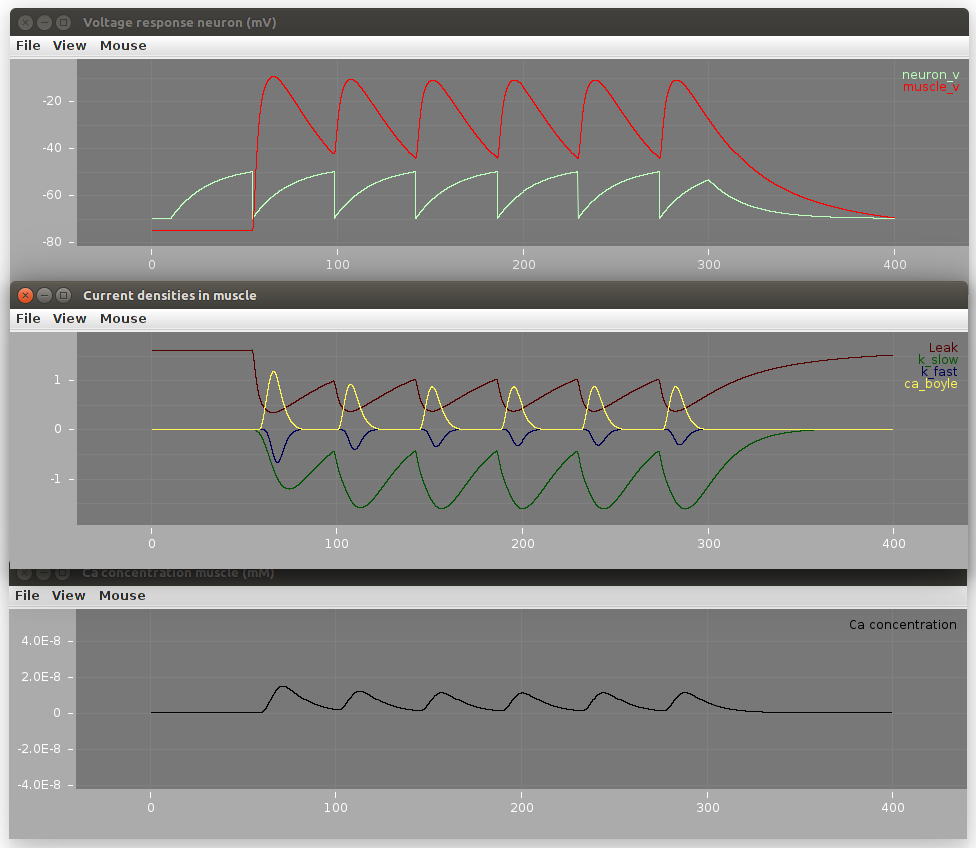

## OpenWorm muscle model

 

Authors: Mike Vella, Alex Dibert, Padraig Gleeson, Rayner Lucas
email:mv333@cam.ac.uk

If you contribute to the project please add your name to the Authors field

<table border="2"><tr><td><b>NOTE: while the NeuroML version of this model is still supported, the most recent work using this muscle model is taking place in the <a href="https://github.com/openworm/c302">c302 repository</a>.</b> </td></tr></table>

### Introduction

This repository contains several different subprojects all related to the construction of a biophysically-detailed model
of the dynamic properties of electrical excitation of the body wall muscle of the c. elegans.

In the figure above, you can see the basic functionality that we are seeking to reproduce.  The electrical activity of a muscle cell
can be recorded using an electrode that is stuck into it.  Connecting the electrode to a sensitive
amplifier and stimulator allows a researcher to either use a [current clamp](https://en.wikipedia.org/wiki/Electrophysiology#Current_clamp) or [voltage clamp](https://en.wikipedia.org/wiki/Voltage_clamp) mode to control and examine the dynamics of the voltage changes or current flow across the membrane.

Ultimately, we understand from [Hodgkin and Huxley](https://en.wikipedia.org/wiki/Hodgkin%E2%80%93Huxley_model) that these electrical dynamics of the membrane are fully determined by the dynamics of [ion channels](https://en.wikipedia.org/wiki/Ion_channel) that sit across the membrane.

In 2008, Dr. Netta Cohen and Dr. Jordan Boyle at the University of Leeds published an article with their mathematical model of these dynamics based on real data.

This model was expressed as a system of equations and a set of parameters in their publication, as well as C++ and Matlab code.  

Their original code has been graciously shared with the OpenWorm project under the BoyleCohen2008 directory.  In addition, a Python port of key components of the model
has been added by OpenWorm contributors (Rayner Lucas).

For the purposes of re-using the model as a component of the larger OpenWorm project, we have converted the mathematical model of Cohen & Boyle into NeuroML2, an XML-based
description of the system of equations that make up mathematical models of biophysically-based models of excitable membranes.

This repository contains the following:

1. Simulation of C.Elegans muscle cell electrical properties, based on Boyle & Cohen 2008.
2. NeuroML 2/LEMS conversion of the muscle cell model
3. Optimization script for the above model, utliising Optimal Neuron package. Optimizing towards sharp electrode data obtained from lab of Michael M Francis.
4. C++ Module for importation of arbitrary Pyramidal model into C++ program such as Palyanov et al SPH solver.

### 1. Simulation of C.Elegans muscle cell electrical properties

The authoritative version of the muscle cell model from Boyle & Cohen has been shared with the project under the [BoyleCohen2008/](BoyleCohen2008/) directory.  Here you will also find a Python port of some of the scripts that demonstrate the dynamics of the muscle model.

An early attempt to convert this model into the NEURON package is available in the [neuron_implementation/](neuron_implementation/) directory (**no longer supported**).

### 2. NeuroML 2/LEMS conversion of the muscle cell model

This version of the muscle model reflects an initial attempt to convert the model from: http://www.sciencedirect.com/science/article/pii/S0303264708001408 into NeuroML 2 (http://www.neuroml.org/neuroml2.php).

See issue: https://github.com/openworm/OpenWorm/issues/169 for the latest.

See also http://www.opensourcebrain.org/projects/muscle_model/wiki.

#### 2.1 Simulation of muscle cell ion channels

The muscle model contains NeuroML2 descriptions of the ion channels in the muscle cell. To create and run LEMS simulations of these ion channels, first install the dependencies as follows:

    INSTALLDIR=~/git
    mkdir $INSTALLDIR
    cd $INSTALLDIR
    git clone https://github.com/openworm/muscle_model

    pip install lxml
    git clone https://github.com/NeuralEnsemble/libNeuroML.git
    cd libNeuroML
    git checkout development
    python setup.py install
    cd ..

    git clone https://github.com/NeuroML/pyNeuroML.git
    cd pyNeuroML
    python setup.py install
    cd ../..

This will install the muscle model and all their dependencies into the directory defined by INSTALLDIR.

To create and run the LEMS simulations, there is a script for each of the NeuroML2 ion channel models. For example, 
to create and run a simulation to analyse the fast potassium channel, go to the `muscle_model/NeuroML2/` subdirectory and run the command:

    ./analyse_k_fast.sh

In this directory, you can run:

    pynml LEMS_NeuronMuscle.xml

to run a simulation of a presynaptic neuron causing the muscle cell to spike:

**Note: neither the presynaptic neuron (modelled as an Integrate and Fire neuron) nor the synapse model are physiologically constrained.**

### 3. Optimization script for the above model

**Note: see https://github.com/openworm/muscle_model/issues/18 for details on the current status of these subprojects.**

See https://github.com/openworm/muscle_model/blob/master/pyramidal_implementation/README.md

### 4. C++ Module for SPH/muscle_model integration

**Note: see https://github.com/openworm/muscle_model/issues/18 for details on the current status of these subprojects.**

This is still at an alpha stage, but has been demonstrated to function as expected.

to compile and run (temp notes with hardcoded paths - replace with your own path)
run the following commands from inside curdir:

$ export PYTHONPATH="/home/mike/dev/cpp_pyramidal_integration/"
OR
export PYTHONPATH=$PYTHONPATH:/home/mike/dev/muscle_model/pyramidal_implementation/
$ g++ main.cpp -l python2.7 -o sim -I /usr/include/python2.7/
$ ./sim

The resultant so file will then be importable in any c++ module and present a PyramidalSimulation class with a run() method which will return the membrane potential at the end of execution of a fixed timestep.

### Reusing this model

The code in this repository is provided under the terms of the [software license](LICENSE) included with it. If you use this model in your research, we respectfully ask you to cite the references outlined in the [CITATION](CITATION.md) file.

